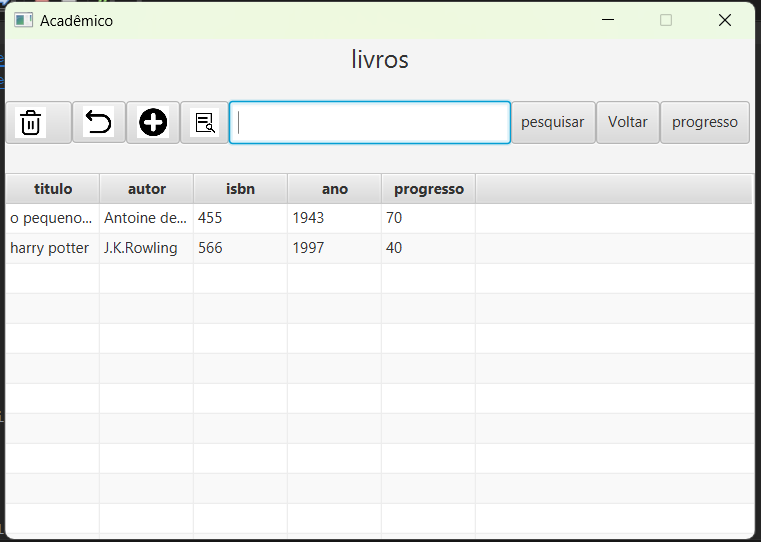
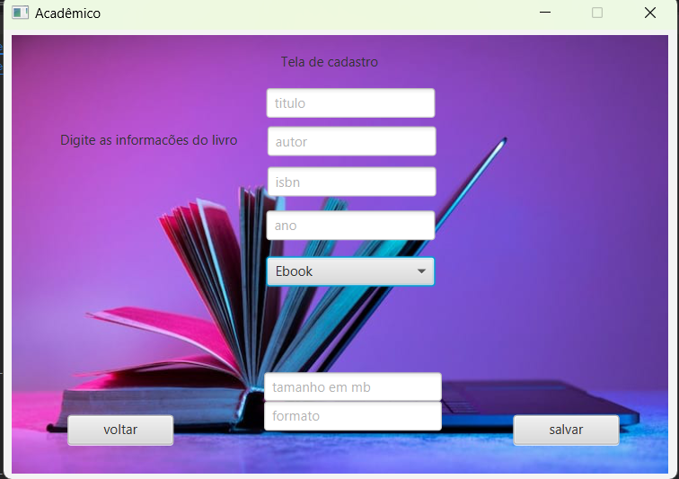
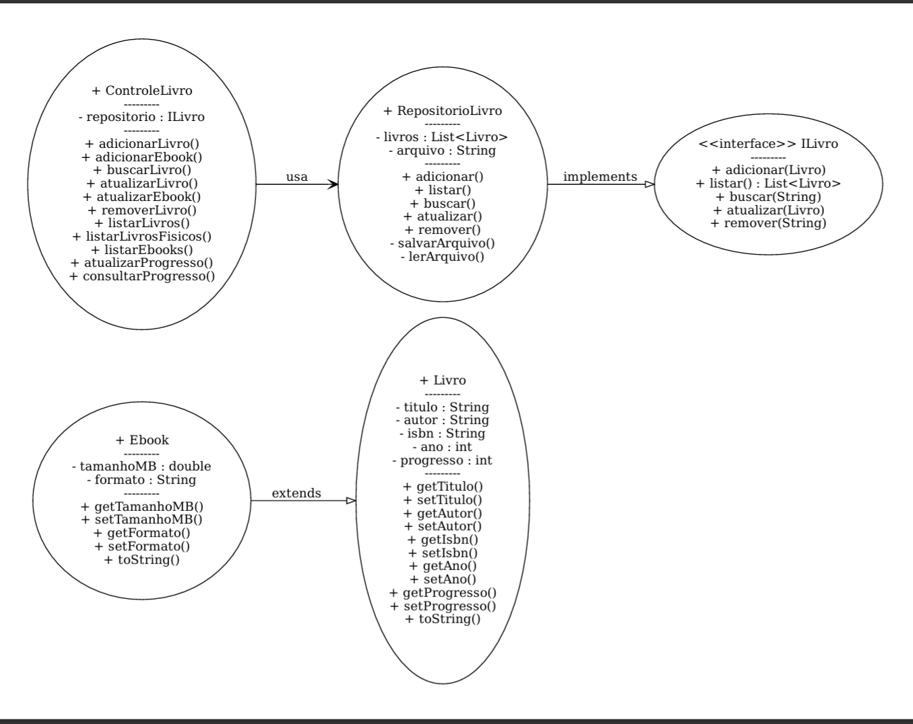

# Colecionateca
📚 Colecionateca - Gestão de Biblioteca Pessoal

A Colecionateca é uma solução digital para leitores e colecionadores que desejam organizar suas obras de forma padronizada. O projeto resolve o problema da fragmentação entre coleções físicas e digitais, permitindo o acompanhamento de progresso e a gestão completa em um único ambiente.

🛠️ Tecnologias e Conceitos Utilizados:

Linguagem: Java.

Interface Gráfica: JavaFX (OpenJFX) e Scene Builder.

Persistência: Serialização de objetos em arquivos binários (.dat).

Arquitetura: MVC (Model-View-Controller).

🚀 Funcionalidades Principais:

Cadastro Híbrido: Diferencia campos para livros físicos (páginas e localização) e ebooks (tamanho em MB e formato).

Controle de Progresso:

Livros Físicos: Calcula automaticamente a porcentagem lida com base na página atual e total de páginas.

Ebooks: Registro direto da porcentagem de conclusão.

Busca Avançada: Filtragem em tempo real na listagem por título ou autor.

Persistência Binária: Os dados são salvos em um arquivo livros.dat através de serialização, garantindo que as informações permaneçam salvas entre execuções.

📸 Demonstração do Sistema:

Interface Inicial
Navegação centralizada para acesso ao acervo e cadastros.

Gerenciamento de Acervo
Tabela interativa para visualização de dados, atualização de progresso e remoção de obras.

Formulário de Cadastro
Interface dinâmica que adapta os campos de entrada de acordo com o tipo de mídia selecionada.

🧩 Princípios de POO Aplicados:

O projeto foi construído utilizando os pilares da Programação Orientada a Objetos:

Herança: As classes Ebook e LivroFisico herdam atributos comuns da classe base Livro.

Polimorfismo: Utilizado na interface ILivro e na sobrescrita do método toString() para exibir detalhes específicos de cada tipo de mídia.

Encapsulamento: Todos os atributos de modelo são privados com acesso via Getters e Setters.

Interfaces: Uso da interface ILivro para definir o contrato de operações CRUD do repositório.

📁 Estrutura do Projeto (MVC)

O código está organizado para facilitar a manutenção e escalabilidade:

src/: Contém a classe principal ProjetoBiblioteca.java que inicia a aplicação e carrega a interface inicial.

src/model/: Classes de domínio (Livro, Ebook, LivroFisico) e a interface ILivro.

src/controller/: Lógica de controle do sistema e controladores das telas JavaFX.

src/view/: Arquivos .fxml que definem o layout visual das interfaces.

src/data/: Implementação do repositório e manipulação do arquivo de dados.

ativos/: Armazena as capturas de tela e o diagrama de classes do projeto.

💻 Como Clonar e Rodar

Clonar o Repositório: No terminal, execute o comando abaixo para baixar o projeto:
git clone https://github.com/Emerson484/Colecionateca.git

Configurar o Ambiente: Certifique-se de ter o JDK 17+ e o JavaFX SDK configurados na sua IDE.

Executar: Abra o projeto e inicie pela classe ProjetoBiblioteca.java.

Persistência: O arquivo livros.dat será gerado automaticamente na primeira execução para salvar seus dados.

Desenvolvido por: Emerson Jesus,Pablo Teixeira,Maicon Ademario,Bruno Vinicius

Disciplina: Programação Orientada a Objetos
